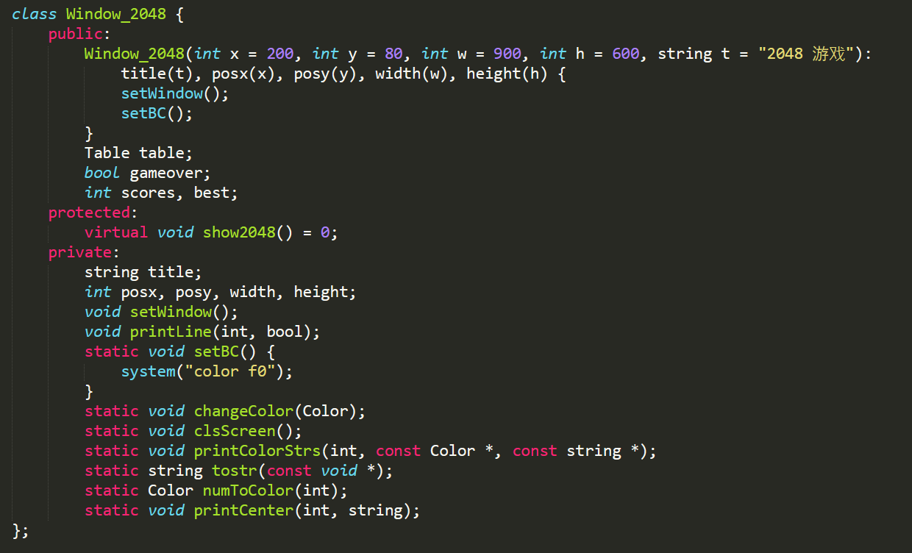

#### 																											用C++面向对象实现的一个2048游戏

##### 1. 项目简介

- 本项目主要包含二个类，Window2048 和 Game2048, 其中Game2048继承自Window2048
- Window_2048:  包含2048游戏的窗口事件，以及一些基本框架数据和函数
- Game_2048：   定义一个 2048 的游戏类，包含其中的游戏逻辑业务部分
- 没有用到任何游戏引擎，只使用单纯的 window.h 接口实现
- 功能:  键盘控制，不同数字颜色不同，数字合并会得分，同时可以记录玩家的历史最高分
- g++ 编译命令:  g++ .\Main_2048.cpp .\Game_2048.cpp .\Window_2048.cpp -o 2048游戏.exe

##### 2. 游戏画如图所示:

##### 3. Window_2048类定义

##### 3. Game_2048类定义

